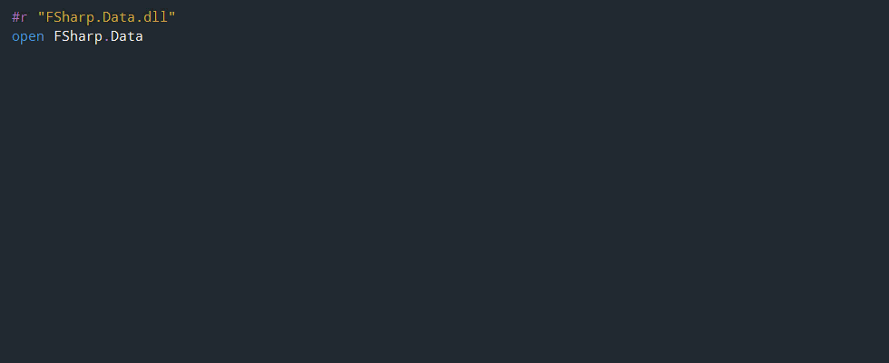

- title : Introduction to F# 
- description : Introduction to F#
- author : Tomasz Heimowski
- theme : white
- transition : default

***

## Introduction to F#

### Tomasz Heimowski

http://theimowski.com/

@theimowski

---

## Agenda

1. Brief history
2. Basics - comparison with Scala
3. Outstanding F# features
4. Evolution of the language

***

## Brief history

* What is F#?
* Origins
* Influencing languages

    
    ===>    
        

---

### What is F#?

> F# is a **mature**, **open source**, **cross-platform**, **functional-first** programming language. It empowers users and organizations to tackle complex computing problems with **simple**, **maintainable** and **robust** code.

http://fsharp.org/

---

### Origins

* Born in 2005 (bundled with VS 2005), from Microsoft Research initiative
* Development lead by Don Syme
* Aimed to incorporate Functional Programming into .NET platform
* Door-to-door with Haskell (Simon Peyton Jones, Simon Marlow)
* Originally closed source

---

### Influencing languages

* OCaml - syntax
* Haskell - functional
* C# - .NET interop
* Scala - FP on OOP platform
* Python - syntax
* Erlang - actor model

***

## Basics - comparison with Scala

* General premises
* Semantics
* Syntax

---

* [F# for Scala developers](https://alfonsogarciacaro.github.io/fsharp-for-scala-developers) by Alfonso Garcia-Caro
* [Comparing Scala to F#](http://mikhail.io/2016/08/comparing-scala-to-fsharp/) by Mikhail Shilkov
* [How does Scala compare to F# as a functional language?](https://www.quora.com/How-does-Scala-compare-to-F-as-a-functional-language) - Quora.com
* [Is F# (F-Sharp) better than Scala? If so, why?](https://www.quora.com/Is-F-F-Sharp-better-than-Scala-If-so-why) - Quora.com

---

### General similarities
### Both F# and Scala:

* Introduce FP to an OOP platform (.NET and JVM),
* Enable interoperability with the existing ecosystem,
* Fall into the category of non-purely functional languages,
* Provide static typing with type inference,
* Ship with a set of base libraries.

---

### Mutable and immutable bindings

    [lang=fsharp]
    let x = 28         // immutable
    let mutable y = 29 // mutable
    y <- 28            // mutation
    let z = x = y      // equality test

    [lang=scala]
    val x = 28         // immutable
    var y = 29         // mutable
    y = 28             // mutation
    val z = x == y     // equality test

---

### Nulls

    [lang=fsharp]
    let x : Option<string> = None // must use option type
    //let y : string = null       // compile error

    [lang=scala]
    val x: Option[String] = None  // can use option type
    val y: String = null          // but can also use null

---

### Functions

    [lang=fsharp]
    let add x y = x + y
    let z = add 10 4                    // function application
    let add5 = add 5                    // curried by default
    let add8toAll = List.map (add 8)    // curry without explicit bind

    let lambda = fun x -> x * 2         // explicit arguments

    [lang=scala]
    def add (x:Int, y:Int) = x + y
    val z = add(10,4)                   // function application
    def addCurry (x:Int)(y:Int) = x + y // curried version
    val add5: (Int) => Int = add(5,_)   // underscore for currying

    val lambda: Function[Int,Int] = _*2 // implicit arguments

---

### Type inference

    [lang=fsharp]
    let x = 28                             // int
    let y = "hello"                        // string
    let add x y = x + y                    // int inferred
    let addF = fun x y -> x + y            // same with lambda
    let doItTwice f = f >> f               // composed function
    let andThen f g = f >> g               // composed function

==> [Hindley-Milner type system](https://en.wikipedia.org/wiki/Hindley%E2%80%93Milner_type_system)

    [lang=scala]
    val x = 28                             // int
    val y = "hello"                        // string
    def add (x:Int, y:Int) = x + y         // explicit types
    val addF: Function[Int,Int,Int] = _+_  // lambda
    val addTwice = add5 andThen add6       // composed function

---

### Discriminated unions (ADT sum types)

    [lang=fsharp]
    type Shape =
    | Rectangle of width: float * height: float
    | Circle of radius: float

    let area = function
    | Rectangle (width, height) -> width * height
    | Circle radius -> System.Math.PI * (radius ** 2.0)

    [lang=scala]
    sealed abstract class Shape
    case class Rectangle(width: Float, height: Float) extends Shape
    case class Circle(radius: Float) extends Shape

    def area(shape: Shape): Double = shape match {
      case Rectangle(width, height) => width * height
      case Circle(radius) => Math.Pi * radius * radius
    }

---

### Tuples (ADT product types)

    [lang=fsharp]
    let meetup = 3, "Functional Tricity"   // constructing
    let (_,group) = meetup                 // pattern matching
    let occurence = fst meetup             // extracting
    let f (occurence, group) = ()
    let call = f meetup                    // as function params

    [lang=scala]
    val meetup = (3, "Functional Tricity") // constructing
    val (_,group) = meetup                 // pattern matching
    val occurence = meetup._1              // extracting

---

### Records (Extended tuples)

    [lang=fsharp]
    type Meetup = { Occurence : int; Group : string }
    let meetup = { Occurence = 3; Group = "Functional Tricity" }
    let { Group = group } = meetup
    let occurence = meetup.Occurence
    let next = { meetup with Occurence = 4 }
    let equal = meetup = { Occurence = occurence; Group = group }

    [lang=haskell]
    data Meetup = Meetup { occurence :: Int, group :: String }
    let meetup = Meetup 3 "Functional Tricity"
    let g = group meetup

---

### Active patterns

    [lang=fsharp]
    let (|Even|Odd|) n = if n % 2 = 0 then Even else Odd

    let test = function
    | Even -> "Even number" 
    | Odd -> "Odd number"

    [lang=scala]
    object Even { 
        def unapply(x: Int) = if (x % 2 == 0) Some(x) else None }
    
    object Odd  { 
        def unapply(x: Int) = if (x % 2 == 1) Some(x) else None }
    
    def test(x: Int) =
        x match { 
            case Even(_) => "Even number" 
            case Odd(_)  => "Odd number" }

---

### Active patterns - partial & args

    [lang=fsharp]
    let (|Integer|_|) (str: string) =
        match System.Int32.TryParse str with
        | (true, i) -> Some i | (false, _) -> None

    open System.Text.RegularExpressions
    let (|ParseRegex|_|) regex str =
        match Regex.Match(str, regex) with
        | m when not m.Success -> None
        | m -> [for x in m.Groups -> x.Value] |> List.tail |> Some

    let parseDate str =
        match str with
        | ParseRegex @"^(\d{1,2})/(\d{1,2})/(\d{1,2})$"
                    [Integer m; Integer d; Integer y]
            -> Some (System.DateTime(y + 2000, m, d))
        | _ -> None

---

### Pipes

    [lang=fsharp]
    let x =
        [2 .. 100]
        |> List.filter (fun x -> x % 2 = 0)
        |> List.map    (fun x -> x * x)
        |> List.reduce (+) 

    val x = 
        (1 to 100)
        .toList
        .filter(_ % 2 == 0)
        .map(x => x * x)
        .reduceLeft(_ + _)

---

### Generics

    [lang=fsharp] 
    let drop list = 
        match list with
        | head :: tail -> tail
        | [] -> failwith "empty!"

    [lang=scala]
    def drop1[A](list: List[A]) = list match {
        case head :: tail => tail
        case _ => throw new Exception("empty!")
    }
    
---

### Generics - map function

    [lang=fsharp]
    let opt   = Option.map (add 5) (Some 28)
    let list  = List.map   (add 5) [2;28] 
    let async = Async.map  (add 5) (async { return 28 })

    [lang=haskell]
    let maybe = fmap ((+) 5) (Just 5)
    let list  = fmap ((+) 5) [2,28]
    let io    = fmap ((+) 5) ((do return 5) :: IO Int) 

==> There are no Higher Kind Types in F#

---

### Computation Expressions

    [lang=fsharp]
    type MaybeBuilder() =
        member __.Bind (m, f) = Option.bind f m
        member __.Return v = Some v

    let maybe = MaybeBuilder()

    type Person = { Mother : Person option; Father : Person option }

    let bothGrandfathers person =
        maybe {
            let! m  = person.Mother
            let! fm = m.Father
            let! f  = person.Father
            let! ff = f.Father
            return (fm, ff)
        }

---

### Computation Expressions

    [lang=fsharp]
    let getQuote symbol = async { return 0.0 }
    let isProfitable symbolA symbolB = true
    let buy amount symbol = async { return () }

    let usdQuote = getQuote "USD" 
    let chfQuote = getQuote "CHF" 

    let purchase = 
        async {
            let! usd = usdQuote
            let! chf = chfQuote
            if isProfitable usd chf then
               buy 1000 "CHF"
            else
               return ()
        }

---

### Scala comprehensions

    [lang=scala]
    def bothGrandfathers(p: Person): Maybe[(Person, Person)] =
        for(
            m <- p.mother;
            fm <- m.father;
            f <- p.father;
            ff <- f.father)
        yield (fm, ff)

    [lang=scala]
    val usdQuote = Future { connection.getCurrentValue(USD) }
    val chfQuote = Future { connection.getCurrentValue(CHF) }
    val purchase = for {
            usd <- usdQuote
            chf <- chfQuote
            if isProfitable(usd, chf)
        } yield connection.buy(amount, chf)

---

### Difference summary

|                     | F#                          | Scala               |
| :------------------ | :-----------------:         | :-----------------: |
| **Paradigm**        | Functional-first            | Both OOP and FP     |
| **FP features\***   | Native to platform, no HKT  | Compiler level      |
| **Syntax**          | Strict, concise             | Loose, verbose      |
| **Scopes**          | Whitespace sensitive        | Curly braces        |

<small>
* Functional features such as <a href=http://stackoverflow.com/a/31929/1397724">generics</a> or <a href="https://blogs.msdn.microsoft.com/fsharpteam/2011/07/08/tail-calls-in-f/">tail calls</a>
</small>

***

## Outstanding F# features

* Type providers
* One-pass compiler
* Units of measure

---

### Type providers

* Given some kind of a schema,
* Provide a fully-fledged type with members,
* To easily consume data,
* And enable IDE intellisense,
* Without worrying about parsing at all.

---

#### JSON Type Provider
#### Open Weather API

http://openweathermap.org/api

---

#### CSV Type Provider
#### Yahoo Finance Stocks

---

#### World Bank Type Provider

http://data.worldbank.org/

---

#### And many more!

* F# Data library: CSV, HTML, JSON, XML, World Bank
* F# Management library: FileSystem, Registry, WMI, Powershell, SystemTimeZones
* F# Configuration library: AppSettings, Resources, Yaml, *.ini
* SQL Clients, R language
* Apiary, Freebase, Excel, Graph, Math, Xaml, CRM, DbPedia
* Twitter, RSS, NuGet, DGML, DataStore, Hadoop/Hive/Hdfs, MiniCvs, COM
* FunScript, Matlab, IKVM, Python, Azure, S3, Neo4j, Swagger
* More on type providers [in this presentation](http://sergey-tihon.github.io/Talks/typeproviders)

---

### One-pass compiler

#### with top-down dependency order

    [lang=fsharp]
    module MyModule =
        
        let add x y = x + y

        let x = add 5 3 // ok

        // let y = sub 5 3 
        // >> error FS0039: The value or constructor 'sub' is not defined

        let sub x y = x - y

---

### One-pass compiler

#### with top-down dependency order

[The "Dependency cycles" series](https://fsharpforfunandprofit.com/series/dependency-cycles.html) by Scott Wlaschin

---

### Units of measure

    [lang=fsharp]
    [<Measure>] type km           // Define the measure units
    [<Measure>] type mi           // as simple types decorated
    [<Measure>] type h            // with Measure attribute

    let speedKmh = 90<km> / 1<h>  // Can be combined through
    let speedMph = 55<mi> / 1<h>  // arithmetic operations

    let v1, v2, v3 = 3.1<km/h>, 2.7<km/h>, 1.5<mi/h>
    let sum = v1 + v2
    //let sum' = v1 + v3          // Error: doesn't compile

    // Can be used in a generic way
    type Vector3D<[<Measure>] 'u> =
        { x: float<'u>; y: float<'u>; z: float<'u> }

Units of measure is a compile-time only feature

---

### Units of measue

#### Epic software bugs related to units mismatch

https://www.laserfiche.com/simplicity/whats-worst-software-bug-history/

***

## Evolution of the language

* F# Software Foundation
* Community-driven
* Cross platform support
* Commercial use
* Projects

---

### F# Software Foundation

http://fsharp.org/

> The mission of the F# Software Foundation is to promote,
> protect, and advance the F# programming language, 
> and to support and facilitate the growth of a diverse 
> and international community of F# programmers.

---

### Community-driven

* Contribution to F# Core
* OSS projects
* Great people
* Mutual support

---

### Cross platform support

http://fsharp.org/guides/mac-linux-cross-platform/

http://ionide.io/

---

### Cross platform support

[F# Survey 2016](https://docs.google.com/forms/d/1l84WGQDUs0EJxVAFWj2jilA3WP0ArgyAqkSnv6Bcffo/viewanalytics)

---

### Commercial use

http://fsharp.org/testimonials/

    
    
    
    

    
    
    

    
    
    
    
    

        
        

---

### Commercial use

---

### Projects

* [FAKE](http://fsharp.github.io/FAKE/) - build automation system
* [Paket](http://fsprojects.github.io/Paket/) - dependency manager for .NET
* [F# Data](http://fsharp.github.io/FSharp.Data/) - type providers for best known file formats
* [F# Power Tools](https://fsprojects.github.io/VisualFSharpPowerTools/) - Visual Studio editor extension
* [Ionide](http://ionide.io/) - package suite for Atom and Visual Studio Code
* [Suave.IO](https://suave.io/) - light-weight web server
* [FsCheck](https://fscheck.github.io/FsCheck/) - library for property-based testing
* [FParsec](http://www.quanttec.com/fparsec/) - parser combinator library
* [Fable](https://fable-compiler.github.io/) - compiler to JavaScript (through Babel)
* [FsReveal](http://fsprojects.github.io/FsReveal/) - slides in markdown / F# script

==> Of course you can use any .NET project in F# 

***

## Summary

1. Brief history
2. Basics - comparison with Scala
3. Outstanding F# features
4. Evolution of the language

---

## Questions